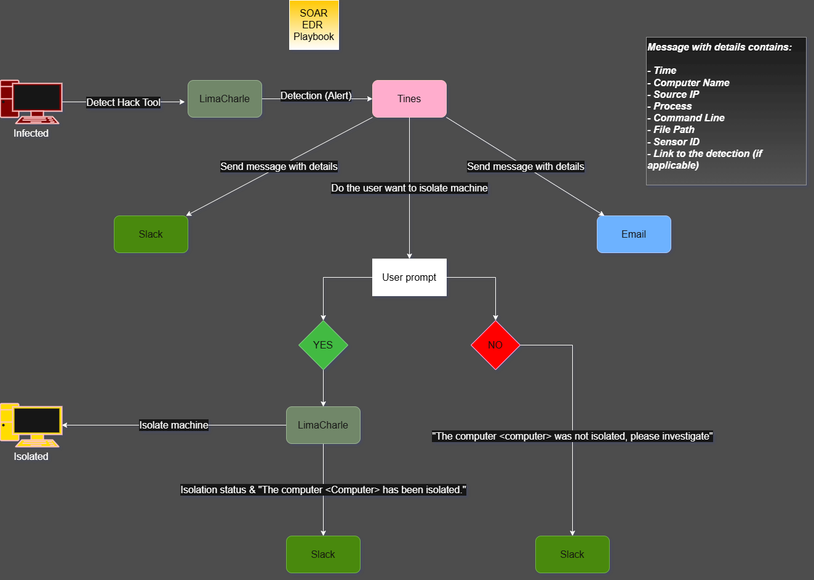
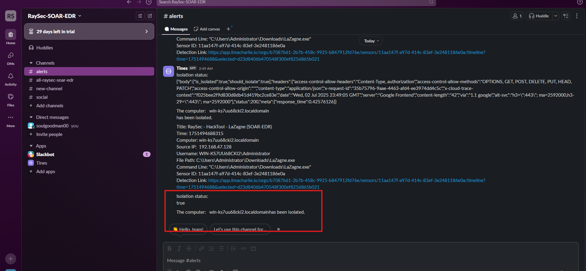

# Integrated Automated Incident Response Framework (EDR & SOAR)



## 📌 Executive Summary
This project demonstrates the architecture, deployment, and testing of an **Automated Incident Response (IR) Framework**. The primary objective is to integrate **LimaCharlie (EDR)** with **Tines (SOAR)**, **Slack**, and **Email notification services** to enable real-time endpoint telemetry monitoring, automated threat triage, and instant threat containment.

By simulating an internal credential-harvesting attack using the **LaZagne** exploit tool within a sandboxed Windows environment, this framework detects malicious behavior, enriches alert metadata, and performs analyst-driven or automated network isolation to reduce **Mean Time to Respond (MTTR)**.

---

## 🏗️ Architecture & Technical Workflow

1. **Threat Simulation**: Executed `LaZagne.exe` inside a sandboxed **Windows Server (VMware Workstation)** to simulate credential access activity.
2. **Telemetry & Detection**: **LimaCharlie EDR** agent captured process execution events (`NEW_PROCESS`) and evaluated them against custom Detection & Response (D&R) rules.
3. **Orchestration**: Upon detection, LimaCharlie dispatched the event payload via Webhook to **Tines SOAR**.
4. **Context Enrichment & Alerting**: Tines parsed the raw JSON payload and forwarded structured alerts containing critical metadata (Hostname, IP, Command Line, File Path, Sensor ID) to **Slack** and **Email**.
5. **Human-in-the-Loop Decision**: Tines triggered an interactive prompt presenting the Security Analyst with containment options ("Isolate" vs. "Do Not Isolate").
6. **Automated Remediation**:
   - **Isolate Approved**: Tines invoked the LimaCharlie REST API to instantly disconnect the compromised VM from the network.
   - **Isolation Denied**: An audit event was posted to Slack marking the endpoint for manual investigation.

---

## 🛠️ Technology Stack

- **Endpoint Detection & Response (EDR)**: LimaCharlie
- **Security Orchestration, Automation & Response (SOAR)**: Tines
- **Communications & Alerting**: Slack API, ProtonMail
- **Virtualization & Environment**: VMware Workstation, Windows Server
- **Threat Simulation**: LaZagne (Credential Access / OS Credential Dumping)
- **Documentation & Architecture**: Draw.io

---

## 🔍 Detection Engineering (LimaCharlie D&R Rule)

```yaml
detect:
  events:
    - NEW_PROCESS
    - EXISTING_PROCESS
  op: is windows
  rules:
    - op: or
      rules:
        - op: ends with
          path: event/FILE_PATH
          value: lazagne.exe
          case sensitive: false
        - op: contains
          path: event/COMMAND_LINE
          value: lazagne
          case sensitive: false
```

---

## 📸 Proof of Execution & Validation

### 1. Context-Rich Alerting (Slack & Email)


### 2. Interactive Analyst Prompt (Tines)


### 3. Network Isolation Verification (Failed ICMP Ping)


---

## 📄 Full Technical Report

For a detailed technical breakdown, threat modeling, and implementation logs, view the full executive report:
👉 **[Download Full Technical Report (PDF)](docs/Automated_IR_Framework_Report.pdf)**

---

## 💡 Key Skills & Competencies Demonstrated

- **Detection Engineering**: Authoring custom D&R rules aligned with the **MITRE ATT&CK Framework** (`T1003 - OS Credential Dumping`).
- **SOAR Workflow Automation**: Designing interactive playbooks, Webhook integrations, dynamic JSON parsing, and API interactions.
- **Telemetry & Process Analysis**: Inspecting Windows execution events, command-line arguments, and process trees.
- **Incident Response**: Streamlining threat isolation and human-in-the-loop workflows to optimize SOC responsiveness.